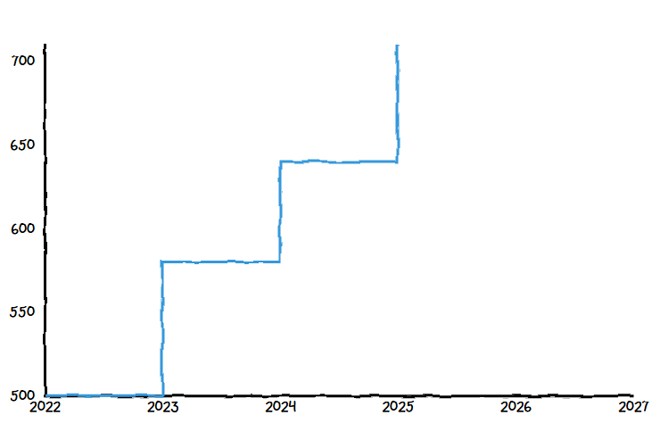
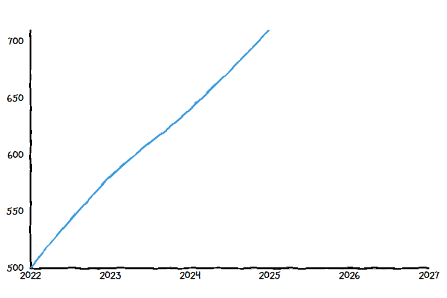
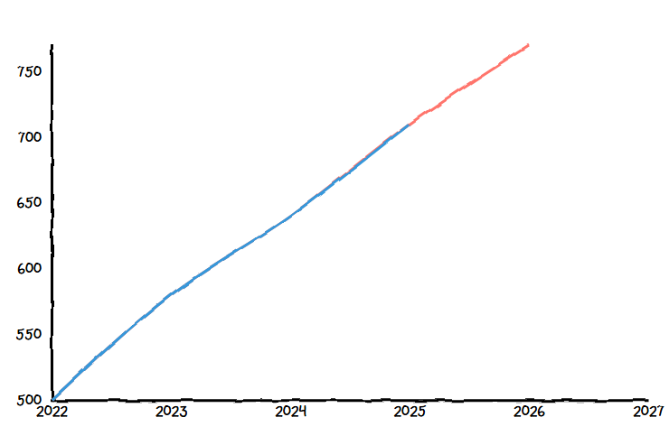

# Mi ez?

Portfolio Performance kompatibilis adatokat előállító script a magyar ingatlanokhoz.

Az adatsorok a https://github.com/Res42/pp-hu-re-data repositoryban találhatók.

## Adatforrások

A projekt fő adatforrása a [KSH Ingatlanadattár](https://www.ksh.hu/s/ingatlanadattar/adattar), ami (akár) utca és épület típus szintre bontott adatokat tartalmaz. A hátránya, hogy évente 1 adatpontot ad ki, illetve hogy ~1-2 éves lemaradásban van az aktuális naphoz.

Ezen hátrányok kiküszöbölésére különböző interpolációkat és/vagy extrapolációkat tartalmazó adatsorok között lehet választani.

## Választható adatsorok

| Adatsor                                                                             |    Interpolált?    |    Extrapolált?    | Időbeli felbontás                             | Adat jellege                                                                                                                                                                                           | Grafikon megjelenése a PP-ben                                                                                                                                                                         |
| ----------------------------------------------------------------------------------- | :----------------: | :----------------: | --------------------------------------------- | ------------------------------------------------------------------------------------------------------------------------------------------------------------------------------------------------------ | ----------------------------------------------------------------------------------------------------------------------------------------------------------------------------------------------------- |
| [ksh](https://github.com/Res42/pp-hu-re-data/tree/master/ksh)                       |         ❌         |         ❌         | **Évente 1 adat**   _(minden év dec. 31.)_ | Csak a KSH átlagárak. ~1-2 éves lemaradás az aktuális naptól.                                                                                                                                          |                                         |
| [ksh-linear](https://github.com/Res42/pp-hu-re-data/tree/master/ksh-linear)         | ✅   _lineáris_ |         ❌         | **Napi 1 adat**                               | Ugyanaz, mint a `ksh`, de interpolált.                                                                                                                                                                 |                                                  |
| [ksh-mnb-linear](https://github.com/Res42/pp-hu-re-data/tree/master/ksh-mnb-linear) | ✅   _lineáris_ | ✅   _lineáris_ | **Napi 1 adat**                               | A KSH-s adatok kiegészítése az MNB lakásárindexszel. ~¼-½ éves lemaradás az aktuális naptól.   **Fontos:** az utolsó KSH-s adatponttól kezdve extrapolálva vannak az adatok az utolsó MNB-s pontig. |  |

## Konkrétan melyik fájl kell nekem?

Négy fajta `JSON` fájl közül lehet választani:

- `cshaz.json`: KSH **családi ház** oszlop
- `panel.json`: KSH **lakótelepi panel** oszlop
- `tobbl.json`: KSH **többlakásos társasház** oszlop
- `total.json`: KSH **lakások összesen** oszlop

Nincs mindig mindegyik fájl (mint ahogy a KSH táblázatban sem), ilyenkor a `total.json`t vagy egy hierarchiával magasabb `JSON`t tudsz használni. Vagy amit akarsz, például egy környékbeli utca adatait, amiben hasonló ingatlanok vannak, mint a tied.

Így válassz fájlt:

1. Nyisd meg az [adatokat tartalmazó projektet](https://github.com/Res42/pp-hu-re-data).
2. Válaszd ki, hogy melyik [adatsort](#választható-adatsorok) szeretnéd használni és nyisd meg azt a mappát.
3. Válassz egy megyét / Budapestet.
   - Ha ilyen felbontású adat kell, akkor válaszd itt ki a mappa alján található `JSON` fájlok közül a megfelelőt.
4. Válassz egy települést / kerületet.
   - Ha ilyen felbontású adat kell, akkor válaszd itt ki a mappa alján található `JSON` fájlok közül a megfelelőt.
5. Válassz egy közterületet.
   - Válaszd ki az egyik `JSON` fájlt.

## Hogyan importáljam be a Portfolio Performanceba?

1. Ha megvan a [kiválasztott fájl](#konkrétan-melyik-fájl-kell-nekem) az előző részből, akkor:
   1. Rakd össze az adatsor URLjét: `https://cdn.jsdelivr.net/gh/Res42/pp-hu-re-data@master/<adatsor>/<...felbontás...>/<tipus>.json`.  
      Például egy kész URL így néz ki: `https://cdn.jsdelivr.net/gh/Res42/pp-hu-re-data@master/ksh-linear/budapest/budapest-11-kerulet/budafoki-ut/tobbl.json`
2. Hozz létre egy új eszközt a PP-ben:
   1. `(+)` gomb (bal oldali panel tetején)
   2. `New instrument` gomb
   3. `Empty instrument` gomb (a felugró ablak alján)
      1. `Name` mezőben adj meg egy nevet, az ingatlan címe például egy jó név.
      2. `Currency` mezőben add meg a HUF értéket (ha még nem lenne automatikusan kitöltve).
      3. `Historical Quotes` fül
         1. `Provider` legördülő menüben válaszd ki a `JSON` lehetőséget
         2. `Feed URL` mezőbe írd be a kiválasztott adatforrás linkjét az `1.1.` lépésből.
         3. `Path to Date` mezőbe írd be: `$[*].date`
         4. `Path to Close` mezőbe írd be: `$[*].price`
      4. `Ok` gomb
3. **‼️ Vegyél az eszközből annyi részvényt, ahány négyzetméteres az ingatlan. ‼️** A vásárlási dátumnak és végösszegnek az ingatlan vásárlási adatait add meg.
4. Készen vagy.

## Köszönetnyilvánítás

@havasd-nek, akinek a https://github.com/havasd/pp-scraper és https://github.com/havasd/pp-data projektje ezt a projektet ihlette.
